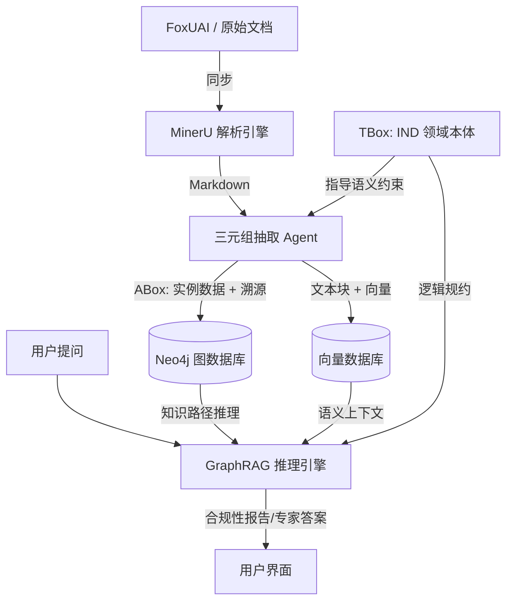

# IND 知识图谱系统技术重构方案 (Ontology-Driven Architecture)

本方案旨在将现有基于统计（TF-IDF）的简单 RAG 系统，重构为以**本体论（Ontology）**为核心的专家级知识推理引擎。系统将保留 MinerU 解析与 FoxUAI 回传的基建，重点对抽取、存储和检索层进行深度重构。

## 1. 总体架构图 (Conceptual Architecture)

---

## 2. 核心重构模块描述

### 2.1 逻辑为骨：全量摘要驱动的 TBox 本体发现 (Wide-Coverage Discovery)
**目标**：通过聚合全量文档摘要，确保实体与逻辑关系覆盖的广泛性与深度。
- **重构方法**：
    - **全量摘要聚合**：自动读取 `output/mineru_markdowns/*.summary.md`，将 28 个文档的摘要融合成一份完整的“IND 知识概览图”。
    - **TBox 发现 Agent (专家模式)**：
        - **输入**：聚合后的全量摘要 + 医药合规专家 Prompt。
        - **任务**：基于全量视野，识别出横跨不同章节的核心实体（Drug, AE, Chemistry, Clinical）、它们在申报流程中的因果逻辑，以及隐含的合规公理。
    - **Schema 结构化**：将 Agent 发现的逻辑提炼为 `ontology/ind_schema.json`。
- **技术实现**：使用长文本大模型（如 Grok-4-long/GPT-4o）处理聚合后的数万字摘要，输出高内聚、广覆盖的本体定义。

### 2.2 数据为肉：ABox 实例化与 100% 溯源 (Evidence Extraction)
**目标**：将 Markdown 文档转化为带证实的知识图谱节点。
- **重构方法**：
    - 开发 `semantic_extractor.py`：调用 OpenAI/Grok API，基于 TBox 提取 [(Subject, Predicate, Object)](file:///d:/%E7%9B%8A%E8%AF%BA%E6%80%9D/IND/IND-knowlege/main.py#93-235)。
    - **强制溯源标记**：在每个 Node 和 Edge 的属性中注入 `source_md`, `chapter_id`, `line_range` 等元数据。
    - **消歧对齐**：使用 LLM 结合标准词典（MedDRA/ChEBI）对实体进行归一化处理（例如：将“拉肚子”对齐到“Diarrhea”）。

### 2.3 知识融合与存储层 (Hybrid Storage)
**目标**：从单机 Pickle 文件 ([db.pkl](file:///d:/%E7%9B%8A%E8%AF%BA%E6%80%9D/IND/IND-knowlege/rag_backend/simple_db/db.pkl)) 永久迁移至生产级数据库。
- **技术选型**：
    - **图存储**：Neo4j (存储实体关系与逻辑公理)。
    - **向量存储**：ChromaDB 或 Milvus (存储 Markdown 语义片段)。
- **迁移路径**：`rag_backend/repository/neo4j_repo.py` 取代现有的 [tfidf_repo.py](file:///d:/%E7%9B%8A%E8%AF%BA%E6%80%9D/IND/IND-knowlege/rag_backend/repository/tfidf_repo.py)。

### 2.4 AI 为魂：基于推理的 GraphRAG (Inference Engine)
**目标**：从“字面检索”进化到“逻辑推理”。
- **重构方法**：
    - 实现 `graph_rag_engine.py`：
        1. **Query 逻辑化**：将用户提问转化为图查询语句 (Cypher)。
        2. **路径遍历**：沿图谱搜寻相关证物。
        3. **推理生成**：结合图谱路径和向量上下文，生成带引用的专家级回答。

---

## 3. 代码模块更新方案 (Migration Map)

| 原模块 | 状态 | 重构方向 |
| :--- | :--- | :--- |
| [main.py](file:///d:/%E7%9B%8A%E8%AF%BA%E6%80%9D/IND/IND-knowlege/main.py) | **修改** | 增加 `Ontology-based Step`，协调三元组抽取。 |
| [analyzer.py](file:///d:/%E7%9B%8A%E8%AF%BA%E6%80%9D/IND/IND-knowlege/analyzer.py) | **保留** | 继续提供分词与关键词基础能力。 |
| [similarity_analyzer.py](file:///d:/%E7%9B%8A%E8%AF%BA%E6%80%9D/IND/IND-knowlege/similarity_analyzer.py) | **废弃** | 被 `SemanticExtractor` 与 `GraphRAG` 取代。 |
| [graph_builder.py](file:///d:/%E7%9B%8A%E8%AF%BA%E6%80%9D/IND/IND-knowlege/graph_builder.py) | **重写** | 从 Pyvis 静态 HTML 转向动态 Neo4j 查询可视化。 |
| `rag_backend/` | **重构** | Repo 层由 TF-IDF 转向 Neo4j+Vector 混合架构。 |
| [foxuai_client.py](file:///d:/%E7%9B%8A%E8%AF%BA%E6%80%9D/IND/IND-knowlege/lib/foxuai_client.py) | **保留** | 核心同步与回传逻辑保持不变。 |

---

## 4. 落地实施建议 (Next Steps)

1. **Schema 样板化**：先针对 1.8 章节编写一个 TBox 样例 JSON。
2. **三元组提取测试**：编写 `test_ontology_extraction.py`，测试 LLM 在不失真情况下从 Markdown 提取医药事实的能力。
3. **Neo4j 环境准备**：配置一个 Docker 版 Neo4j 实例。

> [!IMPORTANT]
> **溯源（Traceability）是生命线**：在所有代码重构中，必须优先保证 `metadata` 中携带原始文件的章节索引信息，这是系统能否通过“行内专家”验收的关键。
